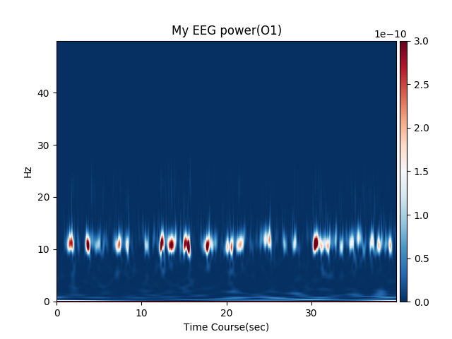
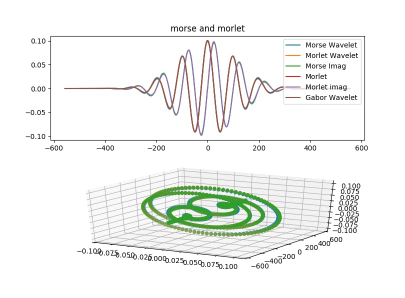
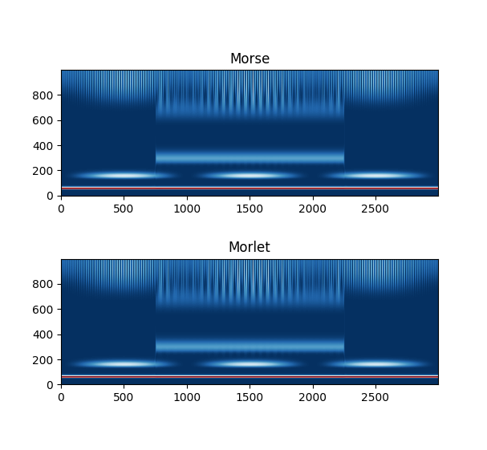

# NinWavelets
This is a python package for analystic wavelet transform.  
Generalized Morse(GMW), Morlet and so on.  
It can also perform CWT based on GMW.  
This project is just my hobby.  
There may be lots of bugs.  
**You should not use this package! m9(^q^) PooGyaaaaa!**

  
This is my alpha band of EEG which was processed by this package.

# Why NinWavelets?
There may be some advantages.

- Use wavelets which is originally Frourier transformed
    + Generalized Morse Wavelets, and so on.
    + Scalable(?)
- Skipping one FFT when performing CWT.
    + May be better and faster if you use FFT method.
- Cuda
    + If you want to process long wave, it may be faster.
- Compatibility
    + You can use it with mne-python.(Now, sensor based only...)

There are some critical limitations, too.  
See Limitations.  

# Install
```
pip install git+https://github.com/uesseu/nin_wavelets
```

# Dependency
- python 3.6.5 or newer(It involves type hint and annotation)

These are automatically installed.  
- Scipy
- numpy
- cupy

If you want to use cuda, please setup cuda.  
[https://developer.nvidia.com/cuda-zone](https://developer.nvidia.com/cuda-zone)  
[https://www.geforce.com/drivers](https://www.geforce.com/drivers)  
It is faster if you process long wave, like my EEG power example.

Optionally, if you want to process EEG/MEG, you can use this.  

- mne

```
pip install mne
```

At first, it was written for mne python.  
but I found that, using mne function with this package is ugly way.  
(Because it needs inverse Fourier transform to no purpose.)  
Now it has own CWT method.  

It is brand new project, and under heavily development.  
Destructive changes may be made m9(^q^) PooGyaaaaa!.  


# Exsample
GMW is similar to morlet wavelet, if you use default param.

You can calculate power.
```
morse = Morse(1000, gamma=3, beta=17.5)
freq = 60
time = np.arange(0, 0.3, 0.001)
sin = np.array([np.sin(time * freq * 2 * np.pi)])

result = morse.power(sin, range(1, 100))
plt.imshow(result, cmap='RdBu_r')
plt.gca().invert_yaxis()
plt.title('CWT of 60Hz sin wave')
plt.show()
```

You can also calculate power.

```python
result = morse.power(sin, range(1, 100))
```

You can also use plot_tf().
It can plot result with colorbar.

```python
from nin_wavelets import plot_tf
plot_tf(result)
```

If you just want to perform cwt only, write like this.

```python
result = morse.cwt(sin, range(1, 100))
```

If you are mne user, epochs can be processed.
See 'NinWavelets for MNE'.

These are results from my test code.  





# Reference
## Morse Class

This is a class to GMW.
Sub class of WaveletBase.

```python
from nin_wavelets import Morse
```

```python
Morse(self, sfreq: float = 1000,
      b: float = 17.5, r: float = 3,
      length: float = 10, accuracy: float = 1,
      interpolate=False, cuda: bool = False) -> None:
```

Parameters

| Param       | Type  | Default |                                                              |
| --          | --    | --      | --                                                           |
| sfreq       | float | 1000Hz  | Sampling frequency.                                          |
| b           | float | 17.5    | beta value                                                   |
| r           | float | 3       | gamma value. 3 may be good value.                            |
| accuracy    | float | 1       | Accurancy paramater. It affects only when you plot wavelets. |
| length      | float | 10      | Length paramater. It affects only when you plot wavelets.    |
| interpolate | bool  | False   | Interpolate frequencies which is higher than nyquist freq.   |
| cuda        | bool  | False   | Use cuda or not. See 'Performance of wavelet transform'.     |


```python
morse = Morse()
```

interpolate=True makes your code faster.
(Up to half time)
But, I dont know whether it is good or bad...

### make_wavelets

Exsample.

```python
wavelet = Morse(1000, 17.5, 3).make_wavelets([10])[0]
```

Make list of wavelets.  

| Param | Type  |                      |
|-------|-------|----------------------|
| freq  | float | List of frequencies. |

Because it returnes bad wave easily,  
you should use it when you plot it only.  
For example, GMW with sfreq=1000, freq=3 returnes bad wave.  
If you want good wave, you must set  
large accuracy and length when you make this instance.  

Returns  
MorseWavelet: list of np.ndarray  

### make_fft_waves

```python
make_fft_waves(self, total: float, one: float,
               freqs: Iterable) -> Iterator:
```
Make Fourier transformed Wavelet.
If the wavelet is originally Frourier transformed wavelet,
it just calculate original formula.
If wavelet is originally not Fourier transformed wavelet,
it run FFT to make them.

### cwt
CWT method.

| Param    | Type  |                                                                      |
|----------|-------|----------------------------------------------------------------------|
| wave     | float | Wave drawed by numpy.                                                |
| freqs    | float | List of frequencies.                                                 |
| max_freq | float | Max freq.                                                            |
| reuse    | bool  | Reuse wavelets you made before. If true, calculation becomes faster. |

```python
def cwt(self, wave: np.ndarray,
        freqs: Union[List[float], range, np.ndarray],
        max_freq: int = 0, reuse=True) -> np.ndarray:
```

example
```python
import numpy as np
freq: float = 60
length: float = 5

time: np.ndarray = np.arange(0, length, 0.001)
sin = np.array(np.sin(time * freq * 2 * np.pi))
morse = Morse()
result = morse.cwt(sin, np.arange(1, 1000, 1))
plt.imshow(np.abs(result), cmap='RdBu_r')
plt.show()
```

max_freq is a param to cut result.

## power
```
power(self, wave: np.ndarray,
      freqs: Union[List[float], range, np.ndarray],
      reuse=True) -> np.ndarray:
```

Run cwt of mne-python, and compute power.

| Param    | Type  |                                                                      |
|----------|-------|----------------------------------------------------------------------|
| wave     | float | Wave drawed by numpy.                                                |
| freqs    | float | List of frequencies.                                                 |
| max_freq | float | Max freq.                                                            |
| reuse    | bool  | Reuse wavelets you made before. If true, calculation becomes faster. |

Returns  
Result of cwt. np.ndarray.  


## MorseMNE Class(Bad way)

MorseMNE class to use function of MNE-python,  
which is Great package to analyze EEG/MEG.  
It is same as Morse class except cwt but  
if you run cwt, it uses mne.time_frequency.tfr.cwt to run cwt.  

But it is not recommended, because mne.time_frequency.tfr.cwt needs  
wavelet which is 'not Fourier transformed'.  
Basically, GMW is a wavelet which is originally  
'Fourier transformed wavelet' and so, you need to run  
InverseFourier transform before you perform CWT.  
I think, this ugly class is disgusting.  

By the way, there is a formula of Morlet wavelet which is Fourier transformed.  
And so, I think, it may be better to use the formula  
even if you use Morlet Wavelet.  

## NinWavelets for MNE

nin_wavelets.EpochsWavelet is a class for Epochs class of mne.

'''python
from nin_wavelets import EpochsWavelet, Morse, plot_tf
from mne import read_epochs

fname = 'hoge_epo.fif'
epochs = read_epochs(fname)
morse = Morse()
result = EpochsWavelet(epochs, morse).power(range(1, 100))
plot_tf(result)
'''

At first, make instance of wavelets(Morse, Morlet and so on).
Then, make EpochsWavelet class.
This has methods named cwt, power and itc.
plot_tf is a function to plot numpy array.

## WaveletBase Class
Super class of wavelets.
You can inherit this class and make new wavelets.

After inherit this, you can edit these methods.  

- BaseWavelet.wavelet_formula
- BaseWavelet.trans_wavelet_formula
- BaseWavelet.peak_freq

At first, you need to overwrite them.
They needs to written by numpy.
These methods are used in the class,
and bothering procedures are done.

## Way to inherit

This is an example.
This code is sub class of BaseWavelet, and is
nin_wavelets.MorletWavelet.

```python
class Morlet(WaveletBase):
    '''
    Morlet Wavelets.
    Example.
    >>> morse = Morse(1000, sigma=7.)
    >>> freq = 60
    >>> time = np.arange(0, 0.3, 0.001)
    >>> sin = np.array([np.sin(time * freq * 2 * np.pi)])
    >>> result = morse.power(sin, range(1, 100))
    >>> plt.imshow(result, cmap='RdBu_r')
    >>> plt.gca().invert_yaxis()
    >>> plt.title('CWT of 60Hz sin wave')
    >>> plt.show()

    Parameters
    ----------
    sfreq: float | Sampling frequency.
        This behaves like sfreq of mne-python.
    sigma: float | sigma value
    accuracy: float | Accurancy paramater.
        It does not make sence when you use fft only.
        Because, Morse Wavelet needs Inverse Fourier Transform,
        length of wavelet changes but it is tiring to detect. :(
        If you use ifft, low frequency causes bad wave.
        Please check wave by Morse.plot(freq) before use it.
        If wave is bad, large accuracy can help you.(But needs cpu power)
    length: float | Length of wavelet.
        It does not make sence when you use fft only.
        Too long wavelet causes slow calculation.
        This param is cutting threshould of wavelets.
        Peak wave * length is the length of wavelet.

    Returns
    -------
    As constructor, Morse instance its self.
    '''

    def __init__(self, sfreq: float = 1000, sigma: float = 7.,
                 accuracy: float = 1., real_wave_length: float = 1.,
                 gabor: bool = False, interpolate: bool = False,
                 cuda: bool = False) -> None:
        super(Morlet, self).__init__(sfreq, accuracy, real_wave_length,
                                     interpolate, cuda)
        self.mode = WaveletMode.Both
        self.sigma = sigma
        self.c = np.float_power(1 +
                                np.exp(-np.float_power(self.sigma, 2) / 2)
                                - 2 * np.exp(-3 / 4
                                             * np.float_power(self.sigma, 2)),
                                -1/2)
        self.k = 0 if gabor else np.exp(-np.float_power(self.sigma, 2) / 2)

    def cp_trans_wavelet_formula(self, freqs: cp.ndarray,
                                 freq: float = 1.) -> cp.ndarray:
        freqs = freqs / freq * self.peak_freq(freq)
        result = (self.c * cp.pi ** (-1/4) *
                  (cp.exp(-cp.square(self.sigma-freqs) / 2) -
                   self.k * cp.exp(-cp.square(freqs) / 2)))
        return result

    def trans_wavelet_formula(self, freqs: np.ndarray,
                              freq: float = 1) -> np.ndarray:
        freqs = freqs / freq * self.peak_freq(freq)
        return (self.c * np.float_power(np.pi, (-1/4)) *
                (np.exp(-np.square(self.sigma-freqs) / 2) -
                 self.k * np.exp(-np.square(freqs) / 2)))

    def wavelet_formula(self, timeline: np.ndarray,
                        freq: float = 1) -> np.ndarray:
        return (self.c * np.float_power(np.pi, (-1 / 4))
                * np.exp(-np.square(timeline) / 2)
                * (np.exp(self.sigma * 1j * timeline) - self.k))

    def peak_freq(self, freq: float) -> float:
        return self.sigma / (1. - np.exp(-self.sigma * freq))
```

All you should do is write formula.  
The formulas may be written in mathmatical papers! ;)  

## Perfomance of wavelet formulas
These formulas are usually complicated like this code.  
And so, making wavelets takes much time.  
  
You should not use '**'. You should use np.float_power.  
You should not use 'e**4'. You should use np.exp.
These are critical.
  
Optionally, you can write code for cupy.  
cupy is faster only when data is big.  

I performed benchmark by notepc  
'Dell G3 15-3579r' with Intel corei7(6core) and Geforce 1050.  

| Length | back ground | CWT time |
|--------|-------------|----------|
| 1sec   | cupy        | 1.28sec  |
| 1sec   | numpy       | 0.872sec |
| 50sec  | cupy        | 7.25sec  |
| 50sec  | numpy       | 15.9sec  |


# Limitations

### Method

Mathmatically, DFT is not good way.  
We have no good method to perform Fourier transform by digital computer.  
Method of convolve is good way for Wavelet transform.  
But GMW needs Frourier transform.  
Further more, convolving needs long long loooong time.
It is not good for Morlet wavelet too.
There may be some methods.

**1**
```
Convolve(wave, wavelet)  # Very good, but slow!
```

**2**
```
iFFT(FFT(wave) * FFT(wavelet))  # Fast, and widely used. But not good. 
```

**3**
```
iFFT(FFT(wave) * FFTed_wavelet)  # Better and faster than 2.
```

I adopted method 3. Not only GMW, but also Morlet wavelet will be performed by 3.

### Hobby
It is just my hobby. I am not professional person.  
Further more, I am not an engineer or PhD or Master.  
Just a man.  

# Licence
'This software is released under the MIT License, see LICENSE.txt.'  
I wanted to write so. But, tellilng you my name thought SNS is said 'Not good!' in my country.  
Mit licence requires my name... I am confused.

# TODO

- Other wavelets
    + [x] Morse
    + [x] Morlet
    + [x] Gabor
    + [ ] Mexican hat
    + [x] Haar
    + [ ] Scalability for unknown wavelets
- More methods
    + [ ] Decimation
    + [ ] DWT
    + [ ] 2D wavelet
- [x] Use cuda or cython and speedup!
    + [ ] It was cythonized before. But it is not good for scalability.
    + [x] It may be faster with cupy if you process long wave.
- [ ] Kill typos(I am a Nip and not good at English) ;(
- [ ] Licence
    + [ ] Whether write my name or not.
    + [ ] Which licence to use.
